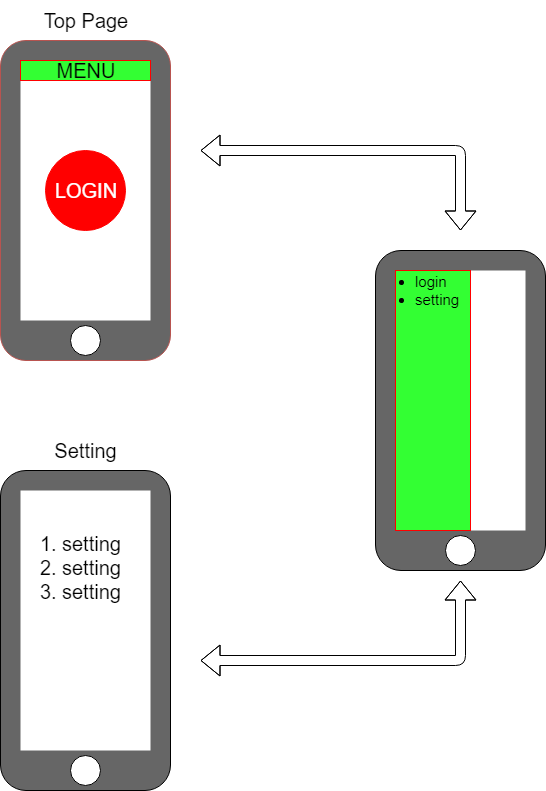

<!-- page_number: true -->

# C# デモプログラム発表会
## 15t5801g 宇野 貴士

----

# Problem

大学のネットワークに接続するたびに 
ACSUにログインするのがめんどくさい （#^ω^）

・・・特にスマホから
 

----

 出来るだけ楽にログインしたい！！！

----

IOSでもAndroidでもWindowsでも使いたい

----

正直沢山プログラムは書きたくない＼(^o^)／

----

# Goal
* ワンクリックでACSUにログインするためのアプリケーションの開発
* 出来ればバックグラウンドで勝手にログインしていてほしい
* マルチプラットフォームで動作し、それぞれのプラットフォーム毎のソースは最小限にしたい
* C#は使わなくてはならない

  ↓

  Xamarinを使ってACSU自動ログインアプリを作る
 

 
----

# Xamarinって？
* microsoftによって買収された企業及び開発しているフレームワーク
* クロスプラットフォーム対応(IOS,Android,UWP)
* Visual Studioが公式サポートをしており、面倒なモバイルアプリの開発環境を容易に作り出すことができる

----

# Layout
